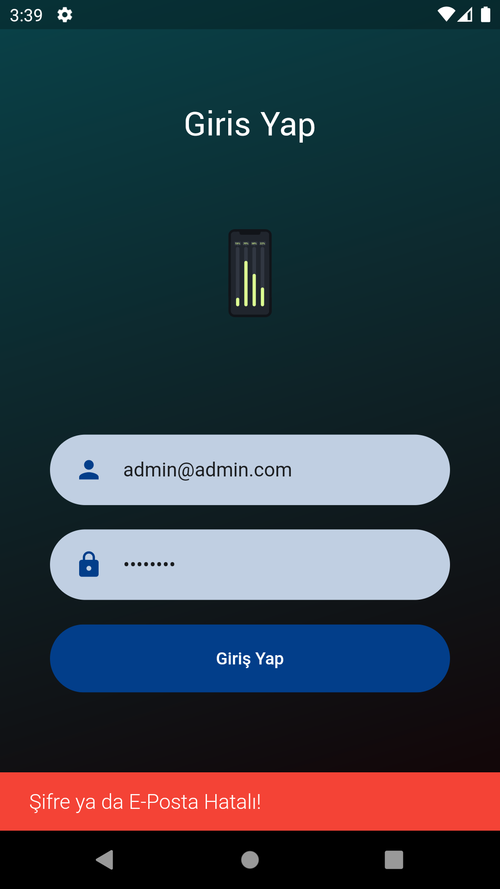
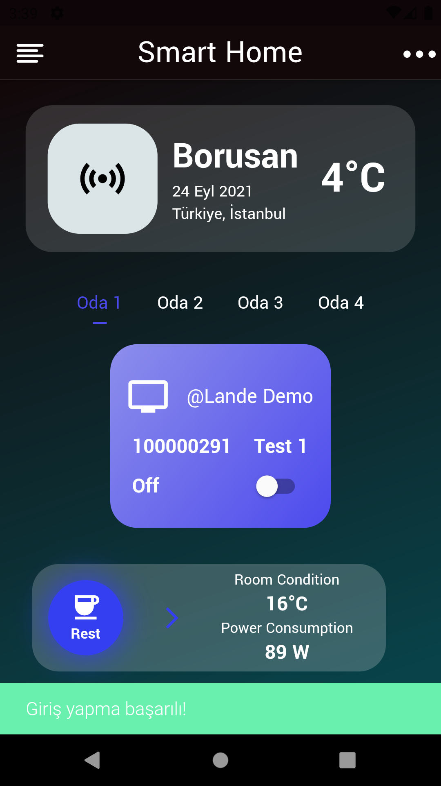
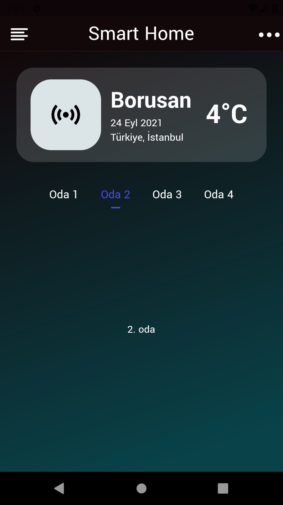

# Flutter MVVM Sensor App
#### - I was developed the app for control the some sensors in the factory. The app making POST and GET request and getting data from response. Also it has clean and understandable architecture.

 ### The app is coding with:
 
 #### -MVVM Design Pattern
 #### -Dio
 #### -Json Serializable
 #### -Build runner
 #### -Provider State Management
 #### -Shared Preferences
 #### -Lottie 
 
 
 ### My Application Design
 
   
 
  
 
